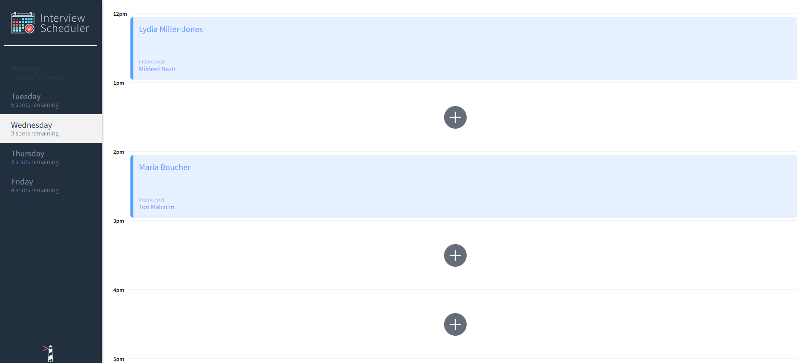
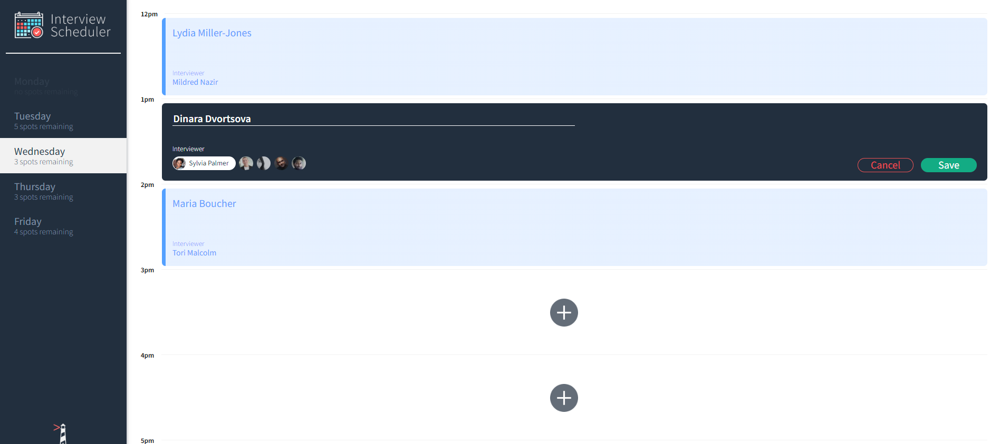
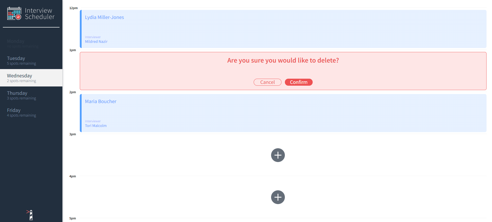
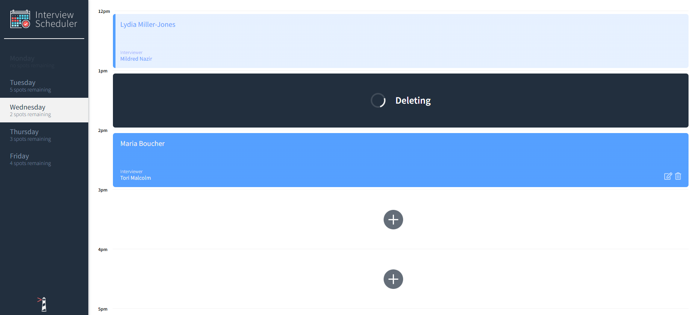

# Interview Scheduler

Interview Scheduler is a React-based single-page application (SPA) that allows students to create, edit, and delete interview appointments. The app is built with a TDD (Test Driven Development) approach. Unit, integration, and end-to-end tests are implemented.

## Final Product
Wednesday appointments - general view

Adding an appointment view

Delete appointment confirmation

Deleting status view

## Features

* Days of the week are shown with color codes based on appointments availability status.
* The days indicate the number of available slots, providing an overview for the week and updating after each change.
* Users can navigate between days to view detailed information.
* Users can schedule interviews by entering a student's name and selecting an interviewer from a provided list.
* Users can modify the details of an existing interview by clicking the edit icon.
* Users can cancel an interview, with a confirmation pop-up appearing before the interview is permanently deleted.

## Setup
To run the app locally:
1. Fork and clone this repository.
2.  Fork and clone `scheduler-api` repository that contains the database.
3. Install dependencies in both folders (scheduler & shceduler-api) using the `npm install` command.
4. Create a database with the command `CREATE DATABASE scheduler_development;`.
5. Copy the `.env.example` file to `.env.development` and fill in the necessary PostgreSQL configuration. 
6. To seed the database:
  - Both of these achieve the same result.
    - Make a `GET` request to `/api/debug/reset` with `curl http://localhost:8001/api/debug/reset`.
    - Use the browser to navigate to `http://localhost:8001/api/debug/reset`.
7. Run both servers (`scheduler` and `scheduler-api`) in your terminal using the `npm start` command.
8. Visit http://localhost:8000/ in your browser.